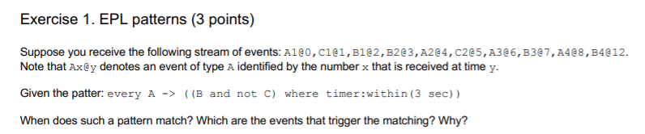

# EPL Statements

```
create schema A (
	n int
);
create schema B (
	n int
);
create schema C (
	n int
);

@Name("Out")
select a.n, b.n
from pattern[
	every a=A -> ((b=B and not c=C) 
	where timer:within(3 sec))
];
```

# Time And Event Sequence

```
A={n=1}
t=t.plus(1 seconds)
C={n=1}
t=t.plus(1 seconds)
B={n=1}
t=t.plus(1 seconds)
B={n=2}
t=t.plus(1 seconds)
A={n=2}
t=t.plus(1 seconds)
C={n=2}
t=t.plus(1 seconds)
A={n=3}
t=t.plus(1 seconds)
B={n=3}
t=t.plus(1 seconds)
A={n=4}
t=t.plus(4 seconds)
B={n=4}
```

# Scenario Results

```
At: 2001-01-01 08:00:07.000
Statement: Out1
Insert
Out-output={a.n=3, b.n=3}
```

# Questions

- When does such a pattern match? 
It can match only after the last "C" event.
In this case, to have a match we have to have an "A" event followed by a "B" event in a time window of 3 seconds.

- Which are the events that trigger the matching? 
They are only A3@6 and B3@7.

- Why?
Because we have to pay attention to the pattern operator precedence. 
We have to give more priority to what happens in the brackets and after to the guard postfix operator (where timer:within()).

[Operator Precedence](http://esper.espertech.com/release-5.4.0/esper-reference/html/event_patterns.html#pattern-op-precedence)

