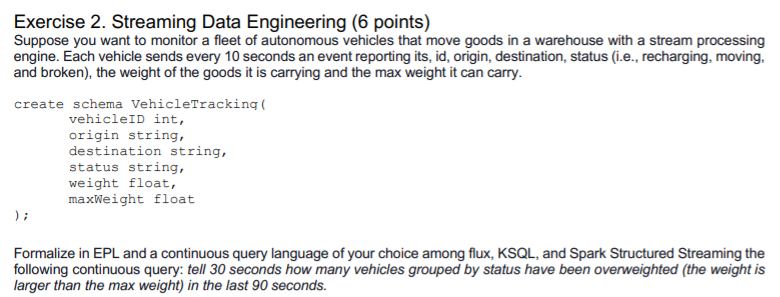

# EPL

```
create schema VehicleTracking(
	vehicleID int,
	origin string,
	destination string,
	status string,
	weight float,
	maxWeight float
);

@Name('Out')
select count(id), id
	from VehicleTracking.win:time(90 seconds)
	where weight>maxWeight
group by status
output last every 30 seconds
```

# kSQL
```
create schema VehicleTracking(
	vehicleID int,
	origin string,
	destination string,
	status string,
	weight float,
	maxWeight float
);

@Name('Out')
select count(id), id
	from VehicleTracking.win:time(90 seconds)
	where weight>maxWeight
group by status
output last every 30 seconds
```