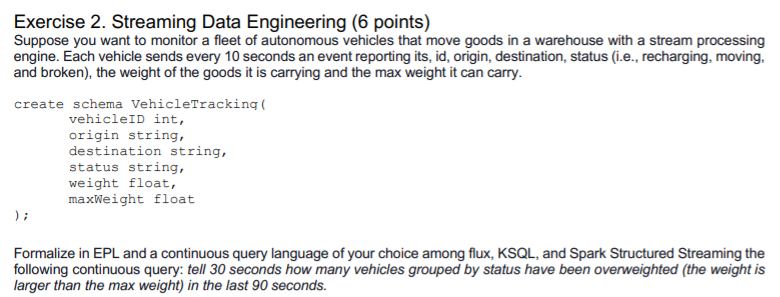

# EPL

```
create schema VehicleTracking(
	vehicleID int,
	origin string,
	destination string,
	status string,
	weight float,
	maxWeight float
);

@Name('Out')
select status, count(*) as Count
	from VehicleTracking.win:time(90 seconds)
	where weight>maxWeight
group by status
output last every 30 seconds
```

# kSQL
```
SELECT count(*), status 
FROM VehicleTrackingStream 
    HOPPING WINDOW (SIZE 90 SECONDS, ADVANCE BY 30 SECONDS) 
    group by status 
EMIT CHANGES;
```

# Spark
```
q0=(VehicleTracking_sdf 
    .withWatermark("TS", "30seconds") 
    .where("weight>maxWeight") 
    .groupBy(window("TS","90 seconds","30 seconds"),"status") 
    .count() 
    .writeStream 
    .queryName("Q0") 
    .start())
spark.sql("Select * from Q0 order by window desc")
```