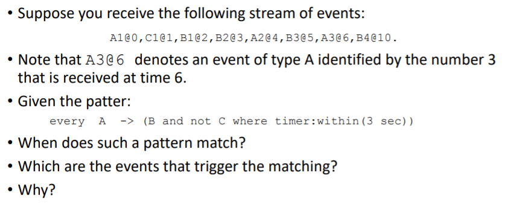

# EPL Statements

```
create schema A (
	n int
);
create schema B (
	n int
);
create schema C (
	n int
);

@Name("Out")
select a.n, b.n
from pattern[
	every a=A -> (b=B and not c=C where timer:within(3 sec))
];
```

# Time And Event Sequence

```
A={n=1}
t=t.plus(1 seconds)
C={n=1}
t=t.plus(1 seconds)
B={n=1}
t=t.plus(1 seconds)
B={n=2}
t=t.plus(1 seconds)
A={n=2}
t=t.plus(1 seconds)
B={n=3}
t=t.plus(1 seconds)
A={n=3}
t=t.plus(4 seconds)
B={n=4}
```

# Scenario Results

```
At: 2001-01-01 08:00:05.000
Statement: Out
Insert
Out-output={a.n=2, b.n=3}
At: 2001-01-01 08:00:10.000
Statement: Out
Insert
Out-output={a.n=3, b.n=4}
```

- **When does such a pattern match?**
Match every "A" event followed by a "B". 
Before the "B" event we can't have a "C" event in a time window LESS (Equal is OK) of 3 seconds.

- **Which are the events that trigger the matching?**
They are: 
 - A2@4 and B3@5
 - A3@6 and B4@10

- **Why?**
Because we have to pay attention to the pattern operator precedence. 
We have to give more priority to the guard postfix operator `where timer:within()`.

[Operator Precedence](http://esper.espertech.com/release-5.4.0/esper-reference/html/event_patterns.html#pattern-op-precedence)
[Pattern Guards](http://esper.espertech.com/release-5.4.0/esper-reference/html/event_patterns.html#pattern-guards)
