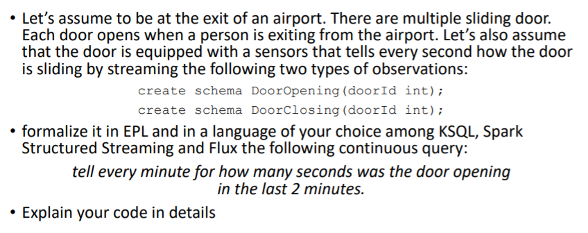

# EPL

```
create schema DoorOpening(doorId int);
create schema DoorClosing(doorId int);

@Name("Out")
select doorId, count(*)
from DoorOpening.win:time(2 minutes)
group by doorId
output last every 1 minute;
```

# kSQL

```
SELECT doorId, count(*)
FROM DoorOpening
	WINDOW HOPPING (SIZE 2 MINUTES, ADVANCE BY 1 MINUTE)
GROUP BY doorId
EMIT CHANGES;
```